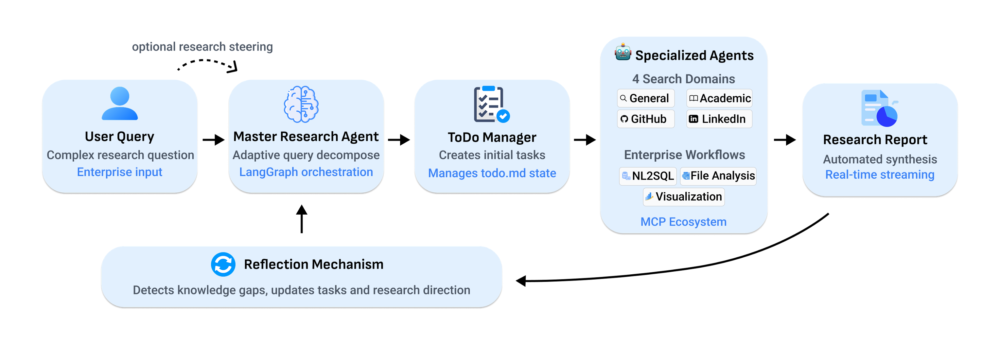

# 🔬 Enterprise Deep Research

[](https://www.python.org/downloads/)
[](https://huggingface.co/datasets/Salesforce/EDR-200)
[](https://opensource.org/licenses/Apache-2.0)
[](https://github.com/SalesforceAIResearch/enterprise-deep-research/stargazers)




We present **Enterprise Deep Research (EDR)**, a multi-agent system that integrate: 
- Master Planning Agent for adaptive query decomposition, 
- Four specialized search agents (General, Academic, GitHub, LinkedIn), 
- Extensible MCP-based tool ecosystem supporting NL2SQL, file analysis, and enterprise workflows, 
- Visualization Agent for data-driven insights, and 
- Reflection mechanism that detects knowledge gaps and updates research direction with optional human-in-the-loop steering guidance. 

These components enable automated report generation, real-time streaming, and seamless enterprise deployment, as validated on internal datasets.


## 🎥 Demos & Features

| Web Application | Slack Integration |
|----------------|-------------------|
| [](https://www.youtube.com/watch?v=gq43g5--dJQ) | [](https://www.youtube.com/watch?v=8tB375P4mgQ) |

**Key Capabilities**: Multi-provider LLM support • Real-time streaming • Document analysis • Citation management • Parallel processing • Specialized benchmarking • Human-in-the-loop steering

## 🚀 Quick Start

**Requirements**: Python 3.11+ • Node.js 20.9.0+

### Installation & Setup

```bash
# Clone and setup
git clone https://github.com/SalesforceAIResearch/enterprise-deep-research.git
cd enterprise-deep-research

# Python environment
python -m venv venv
source venv/bin/activate  # Windows: venv\Scripts\activate
pip install -r requirements.txt

# Configure environment
cp .env.sample .env
# Edit .env with your API keys

# Frontend setup
cd ai-research-assistant && npm install && npm run build && cd ..
```

### Environment Configuration

**Required Variables:**
- `TAVILY_API_KEY` - Tavily search API key
- **One LLM provider key:**
  - `OPENAI_API_KEY` - OpenAI API key
  - `ANTHROPIC_API_KEY` - Anthropic API key  
  - `GROQ_API_KEY` - Groq API key
  - `GOOGLE_CLOUD_PROJECT` - Google Cloud project ID
  - `SAMBNOVA_API_KEY` - SambaNova API key

**Optional Settings:**
- `LLM_PROVIDER` - Default provider (default: `openai`)
- `LLM_MODEL` - Model name (provider-specific defaults)
- `MAX_WEB_RESEARCH_LOOPS` - Max iterations (default: `10`)

### Supported Models

| Provider | Default Model | Available Models |
|----------|---------------|------------------|
| **OpenAI** | `o4-mini` | `o4-mini`, `o4-mini-high`, `o3-mini`, `o3-mini-reasoning`, `gpt-4o` |
| **Anthropic** | `claude-sonnet-4` | `claude-sonnet-4`, `claude-sonnet-4-thinking`, `claude-3-7-sonnet`, `claude-3-7-sonnet-thinking` |
| **Google** | `gemini-2.5-pro` | `gemini-2.5-pro`, `gemini-1.5-pro-latest`, `gemini-1.5-flash-latest` |
| **Groq** | `deepseek-r1-distill-llama-70b` | `deepseek-r1-distill-llama-70b`, `llama-3.3-70b-versatile`, `llama3-70b-8192` |
| **SambaNova** | `DeepSeek-V3-0324` | `DeepSeek-V3-0324` |

### Running the Application

**Full Stack (Recommended):**
```bash
# Terminal 1 - Backend
python -m uvicorn app:app --host 0.0.0.0 --port 8000

# Terminal 2 - Frontend
cd ai-research-assistant && npm start
```

**Backend Only:**
```bash
python -m uvicorn app:app --host 0.0.0.0 --port 8000
```

**Access**: Full Stack at [http://localhost:3000](http://localhost:3000) • Backend at [http://localhost:8000](http://localhost:8000)

## 💻 Usage

### Command Line
```bash
python benchmarks/run_research.py "Your research question" \
  --provider openai --model o3-mini --max-loops 5
```

### Web Interface
Navigate to [http://localhost:8000](http://localhost:8000) for interactive research with real-time progress tracking.

## 📚 Benchmarking & Development

### Supported Benchmarks


- **DeepResearchBench**: Comprehensive research evaluation
- **ResearchQA**: Question-answering with citation verification  
- **DeepConsult**: Consulting-style analysis tasks

### EDR-200 Dataset

The **[EDR-200 dataset](https://huggingface.co/datasets/Salesforce/EDR-200)** contains 201 complete agentic research trajectories generated by Enterprise Deep Research—99 queries from DeepResearch Bench and 102 queries from DeepConsult. Unlike prior benchmarks that only capture final outputs, these trajectories expose the full reasoning process across search, reflection, and synthesis steps, enabling fine-grained analysis of agentic planning and decision-making dynamics.

### Running Benchmarks
```bash
python benchmarks/run_research_concurrent.py  # Concurrent evaluation
python benchmarks/process_deepconsult.py      # DeepConsult dataset
bash benchmarks/run_research.sh               # Full benchmark suite
```

### Development Setup
```bash
# Testing
python -m pytest tests/
python test_agents.py

# Code quality
black src/ services/ benchmarks/
mypy src/ services/
flake8 src/ services/ benchmarks/

# Development server
python -m uvicorn app:app --reload --host 0.0.0.0 --port 8000
cd ai-research-assistant && npm run dev
```

## 📁 Project Structure

```text
enterprise-deep-research/
├── ai-research-assistant/    # React frontend
├── benchmarks/              # Evaluation framework  
├── src/                     # Core research engine
│   ├── agent.py            # Master research agent
│   ├── graph.py            # LangGraph workflows
│   └── tools/              # Research tools & MCP integration
├── services/               # Backend services (research, analysis, parsing)
├── routers/                # FastAPI endpoints
├── models/                 # Data schemas
├── app.py                  # Main FastAPI application
└── requirements.txt        # Dependencies
```

## 📜 License & Citation

Licensed under [Apache 2.0](./LICENSE.txt).

```bibtex
@software{enterprise_deep_research,
  title={Enterprise Deep Research: AI-Powered Research Assistant Framework},
  author={Salesforce AI Research},
  year={2024},
  url={https://github.com/SalesforceAIResearch/enterprise-deep-research}
}
```

**Acknowledgments**: Built on [LangGraph](https://github.com/langchain-ai/langgraph), [Tavily](https://tavily.com), [React](https://reactjs.org/), [Tailwind CSS](https://tailwindcss.com/), and [FastAPI](https://fastapi.tiangolo.com/).
